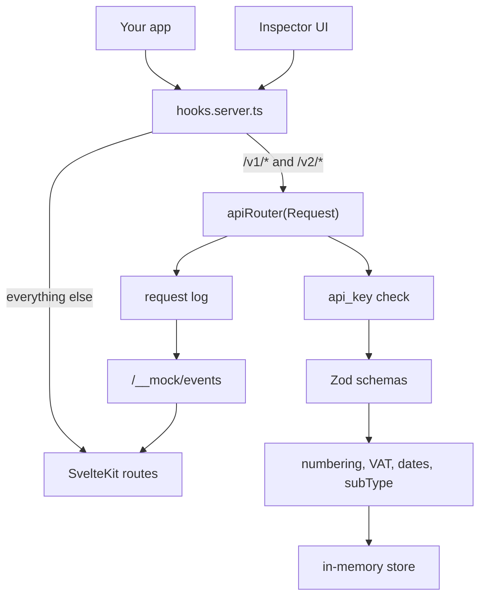

# Full-scope doklado-mock plan (archived)

**Status.** Archived on 2026-08-12. Ten phases for an eight-endpoint mock with
inspector UI, Docker packaging, and conformance tests.

**Current direction.** Scope shrank to what `blizsiekdetom.sk` needs:
`POST /v1/documents/invoice-issue` and `POST /v1/documents/get-invoice-pdf`. Keep
[BEHAVIOUR.md](./BEHAVIOUR.md) and this plan if we expand later. This file is not the
active brief until someone revives the full mock on purpose.

**Source.** Written in the exploration session that produced BEHAVIOUR.md. Also
mirrored under Cursor plans as `doklado_mock_implementation_1de33ecb.plan.md`.

## Phases

Each phase is its own PR. Build, review, merge, then move on. Do not stack phases.

1. **drift-check.** Fetch Doklado's live `swagger.json`, diff against
   `spec/swagger.json`, fail a weekly GitHub Action and open an issue on change.
   First on purpose. Independent of the app, protects everything after it.
2. **scaffold.** Copy the SvelteKit app shell from
   [sveltekit-template](https://github.com/martindzejky/sveltekit-template):
   adapter-node, Vite, TS, Tailwind tokens, ESLint, lefthook, CI, plus Vitest.
   Green pipeline, no mock behaviour yet.
3. **core-domain.** Domain under `src/lib/server/doklado` and state, no HTTP yet.
   Config, in-memory store, response envelope, the four error shapes, Zod schemas,
   numbering, VAT and rounding, date defaults, `subType` from customer country.
   Unit tests against the worked examples in BEHAVIOUR.md.
4. **router-issuing.** `hooks.server.ts` interception and a plain `apiRouter`.
   Implement `invoice-issue`, `issued-invoice-update`, and `/v2/documents` with auth,
   request logging, and pagination that keeps `searchAfter` on a short page then
   drops the key on the terminating empty page. First phase a real client can hit.
5. **pdf.** `pdf-lib`, `fontkit`, embedded Noto Sans for Slovak diacritics.
   Wire `get-invoice-pdf` with the base64 envelope and capitalised `Content-Type`.
   Same invoice id must return byte-identical PDF bytes, which the
   `blizsiekdetom.sk` job worker needs on mid-job resume. After this, that app can
   run against the mock end to end.
6. **remaining-endpoints.** `setExported` with its `results` wrapper,
   `attachments/get` as a flat array, `unprocessed-documents` with
   array-versus-object `data`, and `send-invoice-by-email` as a recorded no-op.
7. **conformance.** Deviations registry plus tests that check responses against
   `spec/swagger.json` while asserting each known spec contradiction still holds,
   so an upstream fix fails the suite.
8. **ui.** Inspector: request log, document list and detail with inline PDF, email
   log, deviations page, live SSE on `/__mock/events`. Template Tailwind tokens, no
   component library.
9. **control-surface.** `/__mock/reset`, `/__mock/seed`, `/__mock/fault`, plus UI
   controls to inject unprocessed documents and attachments. Fix the README line
   that said those queues stay empty.
10. **packaging.** `npx doklado-mock` bin entry, Dockerfile and published image,
    docker-compose snippet like maildev in `blizsiekdetom.sk`, README usage docs.

---

# doklado-mock implementation plan

> Full-scope archive. Status note is at the top of this file.

## Why this exists

[Doklado](https://doklado.com/sk) is Slovak invoicing and pre-accounting software.
Public API, **no sandbox**. Only production. Every issued invoice is a real numbered
document in a real company's books, visible to their accountant and countable on a
VAT return.

That kills the normal development loop. No staging, no integration tests against
their servers, no CI or cloud agent anywhere near it.

This project fills the gap the way [maildev](https://github.com/maildev/maildev)
does for email. Run it locally, point your app's API base URL at it, inspect what
you sent in a small web UI. State lives in memory and dies on restart. In production
you flip one env var back to the real gateway. Nothing else in the app changes.

## What already exists in this repo

At the time of writing, research and tooling only. No application code.

- [BEHAVIOUR.md](BEHAVIOUR.md), roughly 650 lines. Read this before writing code.
  It records how the real API behaves after probing production on 2026-08-05. Every
  claim is tagged Observed, Inferred, or Unknown. Their published spec is wrong in
  about a dozen places. Where the two disagree, this file wins.
- [spec/swagger.json](spec/swagger.json), vendored OpenAPI 3.0.1 snapshot, version
  `2025.2.18`, from `https://api-doc.doklado.sk/swagger.json`. Left out of Prettier
  on purpose so drift diffs stay byte-for-byte.
- [README.md](README.md), [LICENSE](LICENSE) (MIT), and Prettier tooling
  (`package.json`, `prettier.config.mjs`, `.prettierignore`, `.editorconfig`,
  `.nvmrc`, `.npmrc`).
- `.env` and `.env.example` hold credentials only for throwaway scripts that probe
  production. **The mock needs no credentials and must never call real Doklado.**
  Anything under `tmp/` is gitignored scratch from probing.

Do not re-probe production without asking. Those calls create real invoices.

## The consumer that has to work

`blizsiekdetom.sk` (<https://github.com/rozhratko/blizsiekdetom.sk>, private, local
clone at `~/Projects/blizsiekdetom.sk`) is migrating from SuperFaktura to Doklado.
It is why this mock exists, and it is a much smaller consumer than the full API
suggests. The repo is private, so treat the summary below as authoritative if you
cannot open it.

One file talks to the invoicing API: `src/lib/jobs/create-invoice.server.ts`, from a
background job worker. It creates one invoice with a single line item, then
downloads that invoice's PDF. It reads only the invoice id and the PDF bytes.
Everything else in the response is ignored.

Two constraints fall out of that job:

- The worker retries up to three times and **resumes mid-job**, reusing an invoice
  id it already persisted. Fetching the PDF for the same id twice must return
  byte-identical output.
- Create is not idempotent at the API. The app stops double-creation by persisting
  the id before the PDF step. The mock must not invent idempotency the real API
  does not have.

Its `docker-compose.yml` runs postgres, maildev, and umami. SuperFaktura is external
via `SUPERFAKTURA_API_URL`. Doklado mock should slot in the same way: a compose
service plus one env var.

## Reference repositories

Read these. Do not invent their layout. Both public repos use `master`, not `main`.

**<https://github.com/martindzejky/sveltekit-template>** (public) is the base.
Copy its tooling:

- [svelte.config.js](https://github.com/martindzejky/sveltekit-template/blob/master/svelte.config.js)
  (`adapter-node`, defaults)
- [vite.config.ts](https://github.com/martindzejky/sveltekit-template/blob/master/vite.config.ts)
  and [tsconfig.json](https://github.com/martindzejky/sveltekit-template/blob/master/tsconfig.json)
- [eslint.config.mjs](https://github.com/martindzejky/sveltekit-template/blob/master/eslint.config.mjs)
  and [lefthook.yml](https://github.com/martindzejky/sveltekit-template/blob/master/lefthook.yml)
- [.github/workflows/ci.yml](https://github.com/martindzejky/sveltekit-template/blob/master/.github/workflows/ci.yml)
  (four parallel jobs on Node 24, plus a production smoke test)
- Tailwind v4 `@theme` tokens in
  [src/app.css](https://github.com/martindzejky/sveltekit-template/blob/master/src/app.css)
- [TEMPLATE.md](https://github.com/martindzejky/sveltekit-template/blob/master/TEMPLATE.md)
  for conventions, including the optional docker-compose recipe

It has **no** JSON API routes, only two GET-only `+server.ts` files for `robots.txt`
and `sitemap.xml`. The HTTP layer here is new work. No Dockerfile in that template
either.

**<https://github.com/martindzejky/superfaktura-library>** (public) is the closest
prior art on the client side: Zod schemas split into domain types, API wire types,
and adapters, with a typed error taxonomy. Copy the layering idea, not the code.

**<https://github.com/rozhratko/blizsiekdetom.sk>** is the consumer and it is
**private**. A cloud agent probably cannot read it. The consumer section above is
enough. The one file that matters is `src/lib/jobs/create-invoice.server.ts`.

Doklado docs: <https://api-doc.doklado.sk>. Raw OpenAPI:
<https://api-doc.doklado.sk/swagger.json>. Build against the vendored snapshot in
this repo. Fetching the live file is the drift check's job, not the
implementation's.

A separate `doklado-library` client package comes later, in its own repo. Not here.
Tests in this repo use a minimal internal test client.

## How we work: one phase, one PR

Phased work. Each phase is a separate pull request. Build one, open a PR, review it,
iterate, merge, then start the next. Do not stack phases on one branch.

The phase list above is the order. Phase one is tiny and unrelated to the app on
purpose: the swagger drift check protects everything built after it.

Each PR should build, pass the gates, and make sense without the phases that follow.

**Prerequisite at time of writing.** This repo had no git remote. Local `master`
had nowhere to push. Someone has to create the GitHub repository before phase one
can open a PR. An agent should not invent the name or visibility.

## The API in one page

[BEHAVIOUR.md](BEHAVIOUR.md) has the detail and the traps. You will need it.

- Every endpoint is POST, `application/json` both ways. No GET, no path or query
  params, no multipart, no binary bodies. Files travel base64 inside JSON, outward
  only.
- Every request body wraps fields in one `data` key:
  `{"data": {"organizationId": "12345678"}}`.
- Auth is one `api_key` request header. Missing header: HTTP 403
  `{"error":"Unauthorized!"}`. Wrong key: HTTP 401
  `{"error":"You are not authorized to make this request"}`. Neither uses the normal
  response envelope.
- The tenant is `organizationId`, the company's IČO, in the body.
- Success looks like `{"success": true, "data": ...}` where `data` is an object or
  an array depending on the endpoint.
- Application errors return HTTP 200 with `success: false` and a `code`. Four
  mutually incompatible error body shapes exist, and one endpoint can emit all four.
  That is the real behaviour, not a simplification.
- Two name traps. In a request, `organizationId` is your company. In a response it
  is the **counterparty**. Item `price` is a net unit price going in
  (`unitPriceWithoutVat`) and a **gross line total** coming out.

## Shape of the thing

One process, one port. A `handle` hook in `src/hooks.server.ts` intercepts every
`/v1/*` and `/v2/*` request and hands it to a plain router. Everything else falls
through to SvelteKit for the inspector UI.

The router is `(request: Request) => Promise<Response>` with no SvelteKit imports.
That is the testing strategy: tests build a real `Request`, get a real `Response`,
and assert on it. No dev server, no ports, no directory of recorded HTTP. CI keeps
the template's production smoke test
(`.github/workflows/ci.yml` in `sveltekit-template`) to prove the wiring holds.

## Layout

- `src/lib/server/api/router.ts` path dispatch, auth, request logging
- `src/lib/server/api/routes/*.ts` one file per endpoint
- `src/lib/server/doklado/` envelope, errors, schemas, numbering, money, dates,
  subtype
- `src/lib/server/state/store.ts` documents, request log, email log, event emitter
- `src/lib/server/config/` config loading and validation
- `src/lib/server/pdf/` invoice renderer
- `src/routes/` inspector UI plus `__mock/` control endpoints
- `scripts/check-swagger-drift.ts`

## Endpoints

Eight. All POST, all JSON, all bodies wrapped in `data`:

- `/v1/documents/invoice-issue`
- `/v1/documents/issued-invoice-update`
- `/v1/documents/get-invoice-pdf`
- `/v1/documents/send-invoice-by-email` recorded, never sent
- `/v2/documents`
- `/v2/documents/setExported`
- `/v2/documents/attachments/get`
- `/v1/unprocessed-documents`

Unknown paths under `/v1` and `/v2` get logged and return Doklado's 403 shape, so a
typo in an integration shows up in the UI instead of vanishing.

## Faithfulness, and the one place we cheat

[BEHAVIOUR.md](BEHAVIOUR.md) is the specification. The awkward parts are cheap to
reproduce and worth reproducing:

- Zod v4's `z.treeifyError()` emits the `data.errors` plus `data.properties` shape
  we saw, so schema errors come free from using Zod.
- On `/v1/unprocessed-documents`, `data` is an array when empty and an object when
  not.
- Pagination returns a short page that still carries `searchAfter`, then a
  terminating response that drops the key.
- `item.price` is a gross line total while `vatSummary` computes from unrounded
  nets, so a document's own numbers can disagree by a cent.
- Omitted dates become the current timestamp, not midnight.
- An explicit `number` moves the series counter.

`src/lib/server/doklado/deviations.ts` records every intentional difference with a
reason. Conformance tests and a UI page both read from it.

The one cheat I want: **the mock issues from the series marked default in config.**
The real bug picks some other series. With a single configured series there is
nothing to pick wrongly, so faking the bug would invent behaviour we never saw.
Record it as a deviation instead.

Conformance tests validate against [spec/swagger.json](spec/swagger.json) but cannot
assert plain conformance, because production contradicts the spec in a dozen places.
Each known contradiction is a registry entry. The test asserts the mock matches
production and that the spec still differs in exactly that recorded way. If Doklado
fixes their spec, the test fails and tells us.

## Config

A JSON file, Zod-validated, mounted into the container or passed with `--config`.
It holds what the API cannot tell us: organisations by IČO with name, country, home
currency and bank details, numbering series, accepted `api_key` values, and a fixed
exchange rate table so tests stay deterministic. Ship
`doklado-mock.config.example.json` with one organisation that works with no config
at all.

## PDF

`pdf-lib` plus `fontkit` and an embedded Noto Sans subset. Slovak diacritics need
Latin-2 and the PDF standard fonts only reach CP1252. Output is a plausible
one-page invoice, not a facsimile.

Hard requirement from the consumer: `create-invoice.server.ts` in
`blizsiekdetom.sk` resumes a failed job and re-downloads the PDF for an id it
already has. Same id, same bytes. The renderer takes its clock and any randomness
from the store rather than inventing them per call.

## UI

Maildev in spirit. Request log with method, path, code and timing. Click through to
bodies. Document list, document detail with the PDF inline, email log of what would
have been sent. Live via SSE on `/__mock/events`. Template Tailwind v4 tokens, no
component library.

Plus something the real API cannot do: buttons to inject an unprocessed document and
attach a file, because nothing in Doklado's API can populate those queues. That
makes the README line about them staying empty wrong, so edit it.

## Control surface

`/__mock/reset` clears state. `/__mock/seed` loads a fixture. `/__mock/fault` forces
an error code or latency on a chosen endpoint so retry paths can be tested without
waiting for production to misbehave.

## New dependencies

`vitest`, `pdf-lib`, `fontkit`, `zod`, and a Noto Sans font package. Everything else
comes from the template. Get approval before installing any of these.

## Conventions and gates

Match the toolchain the reference repos already use.

- Node 24, pnpm 11.7.0 pinned in `packageManager`, run via Corepack. Use
  `corepack pnpm ...` if the machine's own pnpm is older.
- Prettier is already committed. `pnpm format` must pass. Do not reformat
  [spec/swagger.json](spec/swagger.json).
- After scaffolding, gates are `pnpm check`, `pnpm lint`, `pnpm format`, and
  `pnpm test`, on lefthook pre-push and in four parallel CI jobs like
  `sveltekit-template`.
- Never bypass hooks with `--no-verify`. Never disable a failing test instead of
  fixing it.
- Commit messages follow the `git-commit-style` skill: lowercase title, two to eight
  words, no trailing punctuation. Prose description only when the diff does not tell
  the whole story.
- Locally there is a human at the keyboard. Do not commit unless asked. Check in
  before large diffs or new dependencies.
- Prose in `README.md` and `BEHAVIOUR.md` follows the `unslop-prose` skill. No em
  dashes, no curly quotes.

## Writing style for the mock's own code

The behaviour being reproduced is strange, and the reason for a given line is often
not obvious from the line itself. Where the code looks wrong because production is
wrong, leave a short comment naming the section of [BEHAVIOUR.md](BEHAVIOUR.md) that
justifies it. Do not narrate what the code does.
