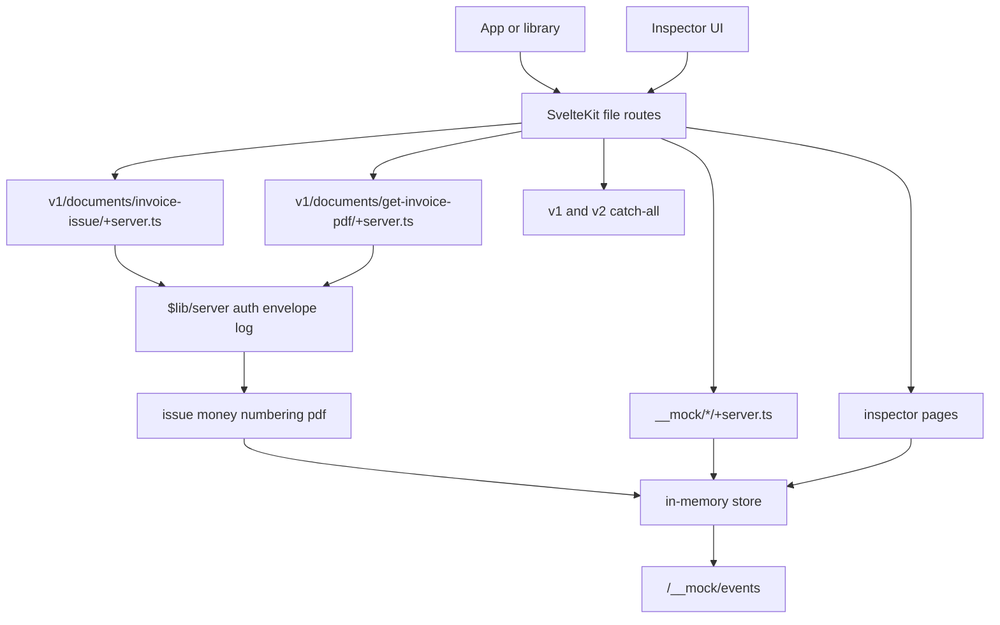

# doklado-mock plan

Active implementation brief. Two Doklado endpoints, a maildev-like inspector, and
`__mock` controls for tests. One phase per PR.

The fuller eight-endpoint plan is archived in [PLAN.full-mock.md](./PLAN.full-mock.md).
Pull from it only what this slice needs. Skip anything that exists only for the other
six Doklado routes. Behaviour detail lives in [BEHAVIOUR.md](./BEHAVIOUR.md).

## Done means

1. `POST /v1/documents/invoice-issue` and `POST /v1/documents/get-invoice-pdf` match
   BEHAVIOUR.md, awkward bits included.
2. The same `documentId` returns byte-identical PDF bytes on re-download.
3. A small UI shows the request log, issued invoices, and their PDFs, live.
4. `__mock` lets tests reset, seed, inject faults, and read state without scraping
   HTML.
5. Runnable via `npx` and Docker, one env var to point at it.

**After this mock works, not before:** a separate `doklado-library` modeled on
[superfaktura-library](https://github.com/martindzejky/superfaktura-library), then
one swap in [blizsiekdetom.sk](https://github.com/rozhratko/blizsiekdetom.sk) that
replaces SuperFaktura. Order is mock, library, consumer swap.

## Consumer

Only call site today: `blizsiekdetom.sk` → `src/lib/jobs/create-invoice.server.ts`.

Creates one paid card invoice with a single line item, then downloads the PDF. Reads
only the invoice id and the PDF bytes. Create is not idempotent; the app persists
the id before the PDF step.

The mock still does full issuing semantics. A stub that only returns an id would lie
to the next library and to anyone poking the UI.

## Doklado endpoints

| Path                                 | Role                                                        |
| ------------------------------------ | ----------------------------------------------------------- |
| `POST /v1/documents/invoice-issue`   | Create invoice; return `{ documentId, invoiceNumber }`      |
| `POST /v1/documents/get-invoice-pdf` | Return `{ "Content-Type", encoding, data }` base64 envelope |

Unknown `/v1/*` and `/v2/*` paths hit required `[...path]` catch-alls. Log the
request, return Doklado's 403 shape. Do not leave Kit's default 404; typos must show
in the inspector log.

## Behaviour fidelity

Read BEHAVIOUR.md before coding these modules. Reproduce at least:

**Transport and envelope.** POST only, `application/json`, body wrapped in
`{ "data": ... }`. Success `{ success: true, data: ... }`. Malformed JSON returns
HTTP 400 Express-style HTML, not JSON.

**Auth.** Missing `api_key`: HTTP 403 `{"error":"Unauthorized!"}`. Wrong key: HTTP
401 `{"error":"You are not authorized to make this request"}`. Neither uses the
normal envelope.

**Errors on invoice-issue.** All four shapes:

- Bare `{ success, code }` where that form applies
- Zod tree with `data.errors` and/or `data.properties.<field>.errors`
- Business-rule `{ success, code, message }` (mask mismatch, incorrect numeric code)
- Conflict `APP_DOCUMENT_ALREADY_EXISTS` with `expenseId`, `invoiceType`,
  `invoiceNumber`, supplier and customer names

**Issuing.** Required: `organizationId`, `type`, `items`, `customer`. Optional dates
and currency default as observed: omitted dates become the creation timestamp;
currency falls back to the org home currency. Request `issueDate` becomes document
`issuedAt`. `type` includes `issued_invoice` and the other values Zod leaked.
`subType` follows customer country (`domestic_exposed` / `foreign_exposed`). On the
stored document, `organizationId` is the counterparty, not the tenant. Document
`email` is the issuer contact, not `customer.contactEmail`. Absent values are `""`,
never `null`. Item `unitPriceWithoutVat` becomes `price` as a **gross** line total.
Per-item `vatAmount`; `vatSummary` from unrounded nets; half-up to two decimals.
`note` fills both `note` and `customText`. `paid: true` records payment at
issue-time total. `transfer` needs an IBAN; `card` does not. Variable symbol comes
from the digits of the invoice number when omitted. Unknown request fields are
ignored; the request log warns.

**Numbering.** Omit `number` and draw from the config default series. Real Doklado
ignores the UI default checkbox; the mock uses the config default instead of faking
that bug, and records it in `deviations.ts`. `accountingSettings.numericCodeId` is
the series export abbreviation, not an id. Explicit `number` is accepted; with
`numericCodeId` set, the mask is validated. An explicit number **moves the series
counter**. Duplicate number → `APP_DOCUMENT_ALREADY_EXISTS`. Document field is
`invoiceNumber`; request field is `number`.

**PDF.** Base64 inside JSON; capitalised `Content-Type` key. One-page PDF with
Slovak diacritics via `pdf-lib`, `fontkit`, and Noto Sans. Same `documentId` →
byte-identical output. Clock and randomness come from the store, not from each call.

`src/lib/server/doklado/deviations.ts` lists intentional differences with a
BEHAVIOUR.md pointer. Tests keep those explicit.

## `__mock` controls

Not Doklado API. JSON, no `api_key`. Taken from the full plan for this slice.

| Path                 | Role                                                                                                                                                                  |
| -------------------- | --------------------------------------------------------------------------------------------------------------------------------------------------------------------- |
| `POST /__mock/reset` | Clear documents, request log, faults; counters back to config                                                                                                         |
| `POST /__mock/seed`  | Load invoice fixtures and/or series counter overrides                                                                                                                 |
| `POST /__mock/fault` | Force error code, HTTP status, or latency on a Doklado path for N calls or until cleared. `afterSuccess` creates the invoice first, then delays or fails the response |
| `GET /__mock/state`  | Snapshot: invoices, counters, recent request log, active faults                                                                                                       |
| `GET /__mock/events` | SSE of store changes for the UI                                                                                                                                       |

Tests should prefer `__mock/state` and `__mock/reset` over parsing HTML. Faults are
how a future library exercises retries without waiting for real Doklado to break.

## Inspector UI

Maildev in spirit. Template Tailwind v4 tokens, no component library.

- Request log with method, path, status/code, timing; click through to bodies and
  unknown-field warnings
- Invoice list: number, customer, total, currency, paid status, created time
- Invoice detail with fields worth reading and an inline PDF
- Live updates over `/__mock/events`
- Buttons for reset and a minimal seed

UI reads the store through SvelteKit routes, not through a Doklado list API.

Skip from the full-plan UI: email log, unprocessed/attachment inject buttons,
deviations page. Deviations stay in code and tests.

## Out of scope

Doklado: `issued-invoice-update`, `send-invoice-by-email`, `/v2/documents`,
`setExported`, attachments, unprocessed-documents.

Also skip: email log in the store, unprocessed-queue seed UI, pagination /
`searchAfter`, polymorphic unprocessed shapes, OpenAPI checks across the whole
swagger file.

Keep lean conformance for the two response shapes we ship. Where production
contradicts `spec/swagger.json` (issue returns `{ documentId, invoiceNumber }` not
`data.document`; PDF uses capitalised `Content-Type`), registry entries pin that.
Tests assert the mock matches production and that the recorded contradiction still
holds.

If those other endpoints come back, open [PLAN.full-mock.md](./PLAN.full-mock.md).

## Architecture

No custom HTTP router. SvelteKit file routing is enough. Doklado and `__mock` paths
are normal `+server.ts` handlers: export `POST` (or `GET`), take `{ request }`,
return `Response` / `json()`. See
[SvelteKit routing](https://svelte.dev/docs/kit/routing).

Shared logic lives under `$lib/server`. Route files stay thin. `hooks.server.ts`
keeps the template localhost/https/www policy for the inspector. `/v1`, `/v2`,
and `/__mock` skip those redirects so Docker service hostnames keep working. The
hook does not dispatch Doklado paths.

An earlier draft invented a parallel `(Request) => Response` router so tests could
skip Kit. Dropped. Unit-test `$lib/server` directly; hit the same domain entry
points the `+server.ts` files call from Vitest.

## Reference repositories

- [sveltekit-template](https://github.com/martindzejky/sveltekit-template) (public,
  `master`): adapter-node, Vite, TS, ESLint, lefthook, CI, Tailwind `@theme` in
  `src/app.css`, `TEMPLATE.md`. No JSON API routes to copy; the HTTP layer here is
  new.
- [superfaktura-library](https://github.com/martindzejky/superfaktura-library)
  (public): Zod domain / wire / adapter layering for the later `doklado-library`,
  not for this mock's guts.
- [blizsiekdetom.sk](https://github.com/rozhratko/blizsiekdetom.sk) (private): the
  consumer summary above is authoritative if the repo is unreachable. Call site:
  `src/lib/jobs/create-invoice.server.ts`.

BEHAVIOUR.md wins over the vendored swagger. `spec/swagger.json` is for drift
detection and the lean contradiction registry.

## Layout

- `src/routes/v1/documents/invoice-issue/+server.ts`
- `src/routes/v1/documents/get-invoice-pdf/+server.ts`
- `src/routes/v1/[...path]/+server.ts` and `src/routes/v2/[...path]/+server.ts`
- `src/routes/__mock/{reset,seed,fault,state,events}/+server.ts`
- `src/routes/` inspector pages
- `src/lib/server/doklado/` envelope, errors, schemas, numbering, money, dates,
  subtype, deviations
- `src/lib/server/state/store.ts` documents, request log, faults, events (no email
  log)
- `src/lib/server/config/`
- `src/lib/server/pdf/`
- `src/hooks.server.ts` template URL policy for the inspector; API paths skip it
- `scripts/check-swagger-drift.ts`

## Config

JSON, Zod-validated, mounted into the container or passed with `--config`.
Organisations by IČO (name, country, home currency, bank, issuer email), numbering
series (name, mask, export abbreviation, counter, default flag), accepted
`api_key` values, fixed exchange rates so foreign-currency tests stay deterministic.
Ship `doklado-mock.config.example.json` with one organisation so zero-config works.

## Tests

- Unit tests for numbering, money/VAT, dates, error helpers against BEHAVIOUR.md
  worked examples
- Handler tests through the same domain entry points the routes call: auth, happy
  path issue, required-field matrix, duplicate number, mask checks with
  `numericCodeId`, paid/card path matching the consumer, PDF envelope, byte-identical
  re-download
- Isolate with `__mock/reset` or a direct store reset; use seed and fault when they
  clarify the case
- No browser for API tests. CI smoke-tests `pnpm build` + `pnpm start` once packaging
  lands

## Dependencies to approve before install

Template stack as in sveltekit-template.

New: `vitest`, `zod`, `pdf-lib`, `fontkit`, a Noto Sans font package.

## How we work

One phase, one PR. Review, iterate, merge, then the next. Do not stack phases.

**Prerequisite.** Create the GitHub remote before a PR can open. Owner creates it;
agents do not invent the name or visibility.

## Phases

1. **docs-and-drift.** This file and the README scope fix land first. Then
   `scripts/check-swagger-drift.ts` and a weekly GitHub Action.
2. **scaffold.** SvelteKit shell from the template, Vitest, CI, lefthook. Green
   pipeline, no Doklado behaviour yet.
3. **core-domain.** Config, store, envelope, four error shapes, Zod schemas,
   numbering, money/VAT, dates, subtype, deviations. Unit tests from BEHAVIOUR.md.
4. **invoice-issue.** `+server.ts` for issue, shared auth/envelope/logging,
   catch-alls, unknown-field warnings. First client-reachable Doklado path.
5. **pdf.** Renderer + `get-invoice-pdf/+server.ts`, identical re-download,
   issue→PDF integration tests. After this the consumer job shape can run end to
   end.
6. **mock-controls.** `__mock/reset|seed|fault|state|events` and tests that use
   them.
7. **ui.** Request log, invoice list/detail with PDF, SSE, reset/seed buttons.
8. **packaging.** Bin entry, Dockerfile, compose snippet, usage docs.

## Conventions and gates

- Node 24, pnpm 11.7.0 via `packageManager` and Corepack
- Prettier already committed; do not reformat `spec/swagger.json`
- After scaffold: `pnpm check`, `lint`, `format`, `test` on lefthook pre-push and
  in CI like the template, plus build smoke when packaging lands
- Never `--no-verify`. Never disable a failing test instead of fixing it
- Commit style and unslop-prose as elsewhere
- Locally, do not commit unless asked. Check in before large diffs or new deps
- Where code looks wrong because production is wrong, comment the BEHAVIOUR.md
  section. Do not narrate what the code does
- Never call real Doklado from the mock
